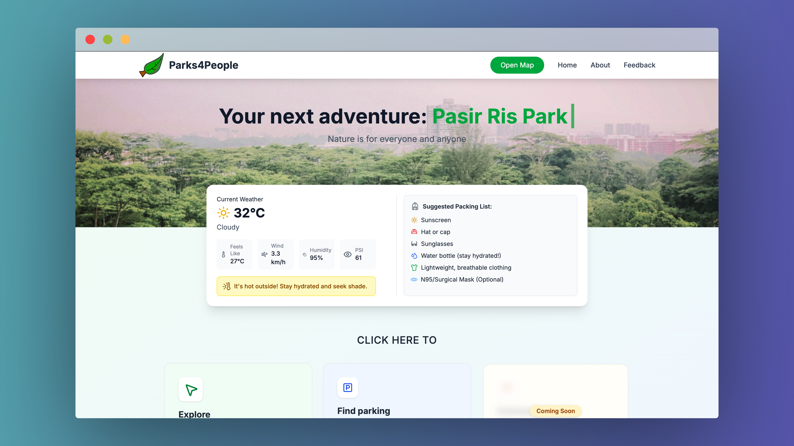
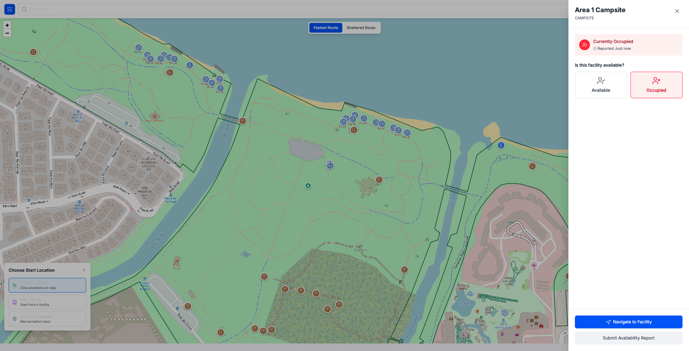
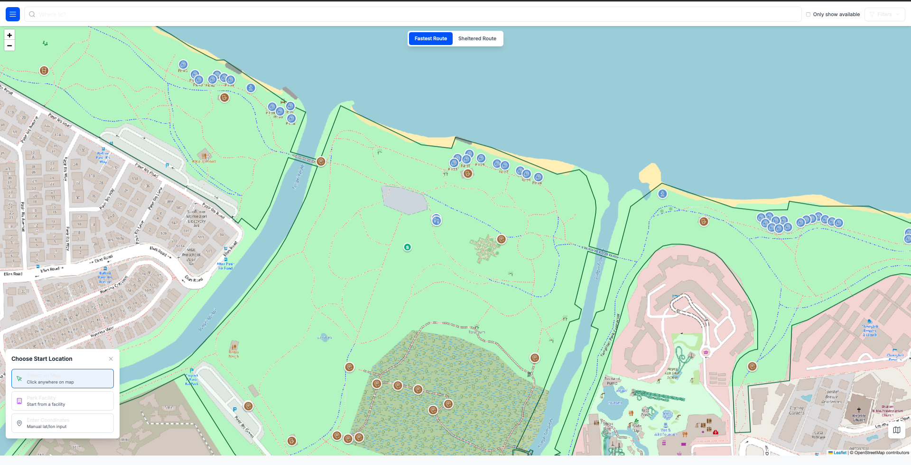
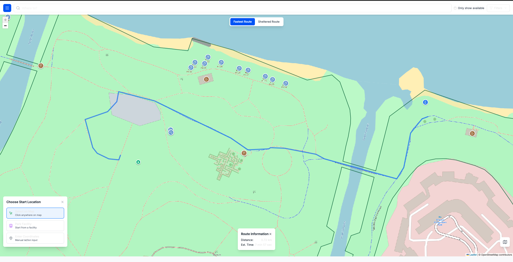
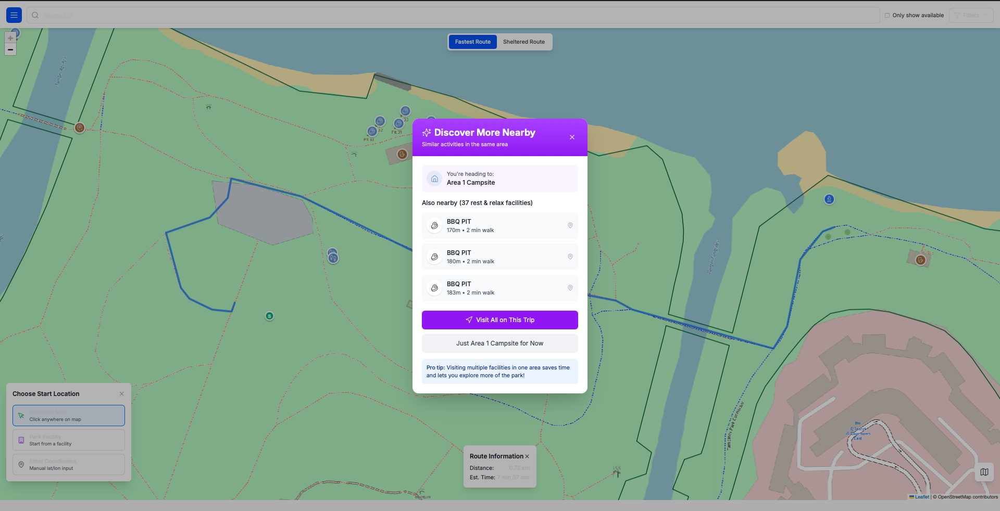
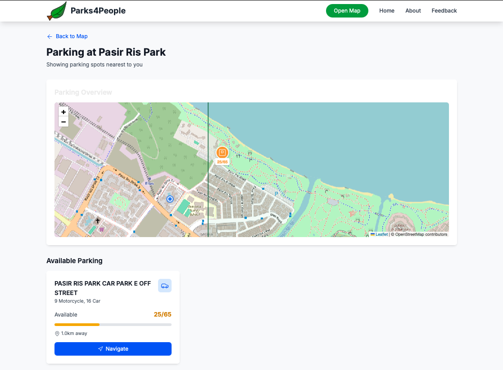

# Parks4People

**Parks4People** is an open-source web application that helps Singaporeans explore and enjoy parks more easily, even in unpredictable weather.

Try it live: [https://parks4people.vercel.app](https://parks4people.vercel.app)

## Overview

Parks4People helps users:

- Discover essential facilities like toilets, eateries, BBQ pits, and shelters
- Navigate between points using sheltered or fastest routes
- Check real-time carpark availability before heading out
- View the current status of facilities (available, occupied, or closing soon)

## How to Use

1. Click "Open Map" on the homepage or use the shortcut under the weather widget  
2. Use the filter icon (top left) to select facility types  
3. Click a facility to view its status and navigate to it  
4. Choose your preferred route type (sheltered or fastest)  
5. Enable location access for better navigation suggestions

## Screenshots

**Facility detail with live status**  

**Select starting point and routing option**  

**Routing example (Will add example for sheltered route soon)**  

**Recommendations nearby a facility**  

**Real-time carpark availability**  

## Why Parks4People?

Planning a park visit shouldn’t be a guessing game. This platform helps you locate key amenities, navigate efficiently, and make more informed decisions. Whether it’s too sunny, raining, or you're simply unfamiliar with the park layout, Parks4People ensures a smoother experience with less friction.

## Demo

Watch a short presentation and walkthrough here:  
[https://www.canva.com/design/DAGuvQ2YONE/4TV3Rf586VoBf9_SIE1YIw/edit](https://www.canva.com/design/DAGuvQ2YONE/4TV3Rf586VoBf9_SIE1YIw/edit)

## About

This project was developed under GovTech’s Girls in Tech Mentorship Programme with the goal of making Singapore’s parks more accessible and intuitive for everyone.

## Future Work

- User-submitted facility availability reports  
- Event calendar integration (e.g. fitness classes, workshops)  
- MRT exit-based routing  
- Accessibility-focused features (e.g. wheelchair-friendly paths)

## Contact & Contribution

We welcome ideas, feedback, and contributions.

GitHub: [@sriyanope](https://github.com/sriyanope)  
Project status: Actively maintained  
